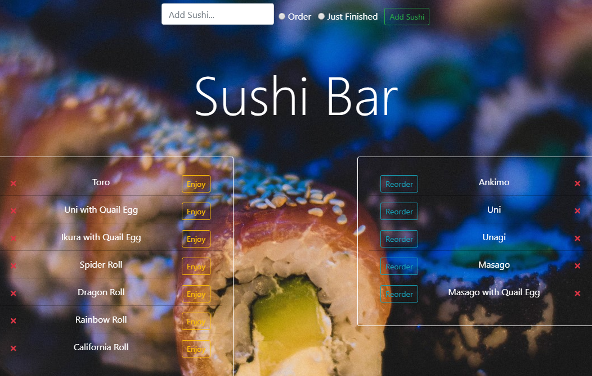

# Sushi Bar
##### A Sushi Logging Application using MySQL, Node, Express, & Handlebars.

Sushi is a remake of the 'Burger' web app with improved functionality.  I was a little underwhelmed by the Burger and since it isn't my favorite food, I decided to add a little to it and spice things up a big with more wasabi.  I added the ability to delete sushi items from the list if they are ones that you do not like, as well as reorder the items that you do.  It uses a MySQL database to store the sushi information, Node & Express to run the server and application, with Handlebars as the templating engine.  This version was made using Bootstrap, but I have another working with UIkit I am working on.  



## Getting Started

These instructions will get you a copy of the project up and running on your local machine for development and testing purposes.  See deployment for notes on how to deploy the project on a live system.

### Prerequisites

In order to install and run Sushi you will need the following:

```
Node.js
Express.js
MySQL
Handlebars
```

### Installing

You will need to do the following steps after cloning the repo to your device in order to ensure that it works properly.

To ensure Node.js is running within the package and configure all modules for use:

```
npm install (or npm install -y)
```

This should install all the requisite modules, but just in case, you will need:

```
express     (npm install -s express)
handlebars  (npm install -s express-handlebars)
mysql       (npm install -s mysql)
body-parser (npm install -s body-parser)
```

## Running Sushi Bar

Sushi is run locally using Node.js, but first you must load the MySQL database, which can be done a number of ways.  The files are inside the 'db' folder, so they can be opened and run in a MySQL GUI to set up the database and seed it if you wish, or you can path into the 'db' folder and run them from the MySQL command line (after logging in) using:
 
```
source schema.sql
source seeds.sql 
```
Once the database has been set up, and the table created,  you can then begin the server simply by path into the root folder for the application and running:

```
node server.js
```

This starts the server which is currently set to run at PORT 8080 (http://localhost:8080/).
That is really all there is to starting the application running, after that it is then all done in your browser.

## Deployment

* [Deployed Site](https://sushi-simple.herokuapp.com/)

I personally have this application deployed using Heroku, with the JawsDB serving to link my database to the application.  More notes and info on this to come...

## Built With

* [Node.js](https://nodejs.org/en/) - Runtime Environment
* [MySQL](https://www.mysql.com/) - Runtime Environment
* [Handlebars](https://handlebarsjs.com/) - Templating Engine
* [Express.js](https://expressjs.com/) - Web Framework
* [Bootstrap](https://getbootstrap.com/) - CSS Framework
* [Font Awesome](https://fontawesome.com/) - Icons
* [gitignore.io](https://www.gitignore.io/) - For creating the .gitignore
* [WebStorm](https://www.jetbrains.com/webstorm/) - JavaScript IDE
* [DataGrip](https://www.jetbrains.com/datagrip/) - Database IDE

## Authors

* **Dalton Ricker** - *Primary Author* - [SasquatchXYZ](https://github.com/SasquatchXYZ)

## Acknowledgments
* Many thanks to my instructors & TAs, as well as the O'Reilly reference books.
